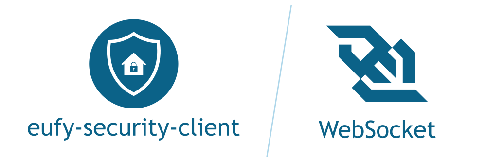

# eufy-security-ws

> [!CAUTION]
> # 🚨🚨🚨 LIBRARY DEPRECATION NOTICE 🚨🚨🚨
>
> Active development moved to https://github.com/mega-yfue/eufy-sdk 
>

---

Small server wrapper around [eufy-security-client](https://www.npmjs.com/package/eufy-security-client) library to access it via a WebSocket.

Join us on Discord:

The development of this server was inspired by the following project:

* [zwave-js-server](https://github.com/zwave-js/zwave-js-server)

Credits go to them as well.

If you appreciate my work and progress and want to support me, you can do it here:

**This project is not affiliated with Anker and Eufy (Eufy Security). It is a personal project that is maintained in spare time.**

## Get started

To try it out or for more information, such as API documentation, Docker image, etc., please see [here](https://bropat.github.io/eufy-security-ws/).

## Deployment

Instructions aimed at maintainers for deploying a new version: [Deployment](docs/deployment.md)

### `RSA_PKCS1_PADDING` / CVE-2023-46809

The Eufy cloud handshake requires `RSA_PKCS1_PADDING`, which Node.js restricted as part of the
Marvin attack fix (CVE-2023-46809). Earlier versions worked around this by launching Node with
`--security-revert=CVE-2023-46809`, but that flag is no longer recognized on Node 24+ and causes
Node to abort on startup (`Error: Attempt to revert an unknown CVE`).

This is now handled by `eufy-security-client`'s embedded (pure-JS) PKCS#1 implementation, which is
enabled by default (`enableEmbeddedPKCS1Support: true`). No Node flag is required and you no longer
need to set anything. To opt out, set `"enableEmbeddedPKCS1Support": false` in your config file.

## Changelog

### 1.9.9 (2026-02-14)

* Upgrade to eufy-security-client 3.7.0
* Feature: Add search by date for events @temp-droid in https://github.com/bropat/eufy-security-ws/pull/502
* Fix: Fixed websocket handle by @temp-droid in https://github.com/bropat/eufy-security-ws/pull/499
